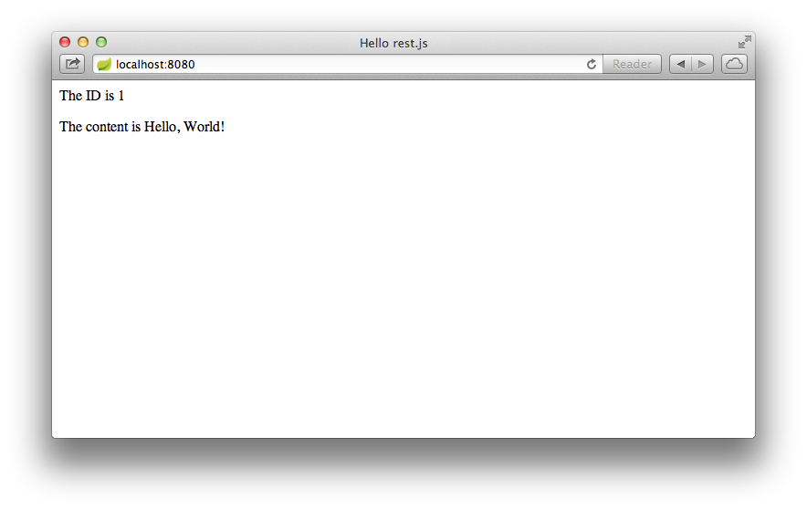

This guide walks you through the process of consuming a simple rest.js
client that consumes a Spring MVC-based [RESTful web service][u-rest].

What you'll build
-----------------

You will build a rest.js client that consumes a Spring-based RESTful web service.
Specifically, the client will consume the service created in
[Building a RESTful Web Servce][gs-rest-service].

The rest.js client will be accessed by opening the `index.html` file in
your browser, and will consume the service accepting requests at:

    http://rest-service.guides.spring.io/greeting

The service will respond with a [JSON][u-json] representation of a greeting:

```json
{"id":1,"content":"Hello, World!"}
```

The client will render the ID and content into the DOM.

You can customize the greeting with an optional *query string* in the url:

    http://localhost:8080/?User

The code will send a parameter to the REST endpoint and
render a custom greeting into the DOM.


What you'll need
----------------

 - About 15 minutes
 - A favorite text editor
 - A modern web browser
 - An internet connection
 - Node.js and git pre-installed
 - Bower installed as a global node.js package

<a name="scratch"></a>
<a name="initial"></a>
Create bower configuration files
---

First, create a bower control file, `.bowerrc`.  This file tells bower
where to put the JavaScript dependencies.  The `.bowerrc` file should
be located at the root of the project (`gs-consuming-rest-restjs/initial`) and
formatted as JSON:

`.bowerrc`
```bowerrc
{
	"directory": "public/lib"
}
```

From a command prompt at the root of the project, run `bower init`.
This will create a `bower.json` file that describes the
JavaScript packages required by the project.  Bower will ask for several
bits of information such as a project name, license, etc.  If in doubt,
just press `Enter` to accept the defaults.

Next, use bower to install rest.js and an AMD module loader such as
curl.js.  From the command prompt, type:

```
bower install --save rest#~1
```

```
bower install --save curl#~0.8
```

Bower will install rest.js and curl.js into the directory we listed
in `.bowerrc`.  Since we specified the `--save` option, bower will
store the package information in the `bower.json` file.

> **Note:** Bower should discover that rest.js depends on when.js
and install a compatible version.

When done, the `bower.json` file should have a "dependencies"
object property that lists "curl" and "rest" as property names and
their semver information as values:

`bower.json`
```json
{
  "name": "draft-consuming-rest-rest.js",
  "version": "0.0.1",
  "authors": [
    "John Hann <jhann@gopivotal.com>"
  ],
  "license": "http://www.apache.org/licenses/LICENSE-2.0",
  "ignore": [
    "**/.*",
    "node_modules",
    "public/lib",
    "test",
    "tests"
  ],
  "dependencies": {
    "curl": "~0.8",
    "rest": "~1"
  }
}
```


Create a render module
---

First, create a render function to inject data into an HTML document.

`public/hello/render.js`
```js
define(function (require) {

    var ready = require('curl/domReady');

    return render;

    function render (entity) {
        ready(function () {
            var idElement, nameElement;

            idElement = document.querySelector('[data-name="id"]');
            nameElement = document.querySelector('[data-name="content"]');

            idElement.textContent += entity.id;
            nameElement.textContent += entity.content;
        });
    }

});
```

This module uses simple DOM querying and manipulation to inject text
into the document.  To ensure that the DOM is not used before it is
ready, the render module imports and uses curl.js's `domReady`
function-module.

> **Note:** In a real application, you'll want to use *data binding* or
*templating*, rather than DOM manipulation as shown here.


Create an application composition module
---

Next, create a module that will compose the application.

`public/hello/main.js`
```js
define(function (require) {

    var rest = require('rest');
    var mime = require('rest/interceptor/mime');
    var entity = require('rest/interceptor/entity');
    var render = require('./render');

    var endpointUrl, name, client;

    endpointUrl = 'http://rest-service.guides.spring.io/greeting';
    name = document.location.search.slice(1);

    client = rest
        .chain(mime, { mime: 'application/json' })
        .chain(entity);

    client({ path: endpointUrl + '?name=' + name })
        .then(render);

});
```

The main module reads the query string from the document's location
object, configures a rest.js mime client, and calls the REST endpoint.

rest.js returns a Promises/A+ promise,
which will call the `render` function-module when the endpoint returns
data.  The `render` function expects the entity, but the rest.js client
normally returns a response object.  The "rest/interceptor/entity"
interceptor plucks the entity from the response and forwards that
onto the `render` function.


Create a boot script
---

Next, create the boot script, `run.js`:

`public/run.js`
```js
var curl;
(function () {

    curl.config({
        main: 'hello',
        packages: {
            // Your application's packages
            hello: { location: 'hello' },
            // Third-party packages
            curl: { location: 'lib/curl/src/curl' },
            rest: { location: 'lib/rest', main: 'rest' },
            when: { location: 'lib/when', main: 'when' }
        }
    });

}());
```

This script configures the AMD loader: `curl.config()`.  The `main`
configuration property tells curl.js where to find the application's
main module, which will be fetched and evaluated automatically.
The `packages` config object tells curl.js where to find modules
in our application's packages or in third-party packages.


Create the application page
---

Finally, create an `index.html` file and add the following HTML:

`public/index.html`
```html
<!doctype html>
<html>
    <head>
        <title>Hello rest.js</title>
        <script data-curl-run="run.js" src="lib/curl/src/curl.js"></script>
    </head>
    <body>
        <div>
            <p data-name="id">The ID is </p>
            <p data-name="content">The content is </p>
        </div>
    </body>
</html>
```

The `script` element loads curl.js and then loads an *application boot
script* named "run.js".  The boot script initializes and configures
an AMD module environment and then starts the client-side application code.


<a name="run"></a>
Run the client
--------------

You can now run the app using the Spring Boot CLI (Command Line Interface). Spring Boot includes an embedded Tomcat server, which offers a simple approach to serving web content. See [Building an Application with Spring Boot][gs-spring-boot] for more information about installing and using the CLI.

```sh
$ spring run app.groovy
```

Once the app starts, open http://localhost:8080 in your browser, where you see:



The ID value will increment each time you refresh the page.


Summary
-------

Congratulations! You've just developed a rest.js client that consumes a
Spring-based RESTful web service.

[gs-rest-service]: /guides/gs/rest-service/
[gs-spring-boot]: /guides/gs/spring-boot/
[zip]: https://github.com/spring-guides/gs-consuming-rest-restjs/archive/master.zip
[u-rest]: /understanding/REST
[u-json]: /understanding/JSON
[u-git]: /understanding/Git
